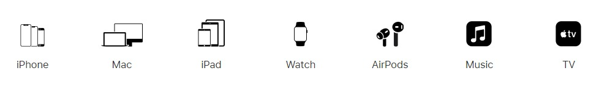

# DOM Manipulated :-)

### Following are some interesting work done to understand DOM Manipulation properly. This actually was an assignment of the Full Stack JavaScript Bootcamp by [iNeuron](https://www.ineuron.ai/)

* **Tweaking [dev.to](https://www.dev.to)**
> Target the top description and change the name to  Name and the bottom description lines to my passion.


I used DOM manipulations to change above thing to like this:


Code used:<br>
```javascript
const title = document.querySelector(".side-bar .crayons-card .crayons-subtitle-2");

title.innerHTML = "Raushan Kumar";


const description = document.querySelector(".side-bar .crayons-card p");

description.innerText = "I am a coder and I love to build applications using JavaScript tech stack.";
```

<br>
<br>


* **Fetching data from Apple website.**

> Fetch all product names and store it in an array from [apple](https://support.apple.com/en-in) website.


(
Code used: 
```javascript
const products = document.querySelectorAll(".as-imagegrid-item-title");

const a = [];

products.forEach(e=>{
    e.removeChild(e.clastChild);
    a.push(e.innerHTML);
});
// ['iPhone ', 'Mac ', 'iPad ', 'Watch ', 'AirPods ', 'Music ', 'TV ']
```

<br>
<br>

* **Adding another list item in the [Youtube Support](https://support.google.com/youtube/) website.**

Target :


Output:


Code Used:
```javascript
const accordion = document.querySelector(".accordion-homepage");

const content = `<h3 role="button">
                    My New FAQ
                </h3>`;

const section = document.createElement("section");

section.classList.add("parent");

section.innerHTML = content;

accordion.appendChild(section);

```

<br>
<br>

* **Changing the Contact Number in [OnePlus](https://www.oneplus.in/support) website:**

Target:


Output:


Code Used:
```javascript
const contact = document.querySelector(".contact-us .customer-support a");

contact.innerText = "+91 8084644000";
```
<br>
<br>

* **Changing the button text in [Samsung](https://www.samsung.com/in/offer/online/samsung-fest/) website.**

Target:


Output:


Code Used:

```javascript
const button = document.querySelector(".feature-column-carousel__button a.cta--contained.cta--black");

button.innerText = "Check Out";
```

<br>
<br>

* **Changing the background color to red in the search bar of the [Adidas](https://www.adidas.co.in/) website.**

Target:


Output:


Code Used:

```javascript
const searchBar = document.querySelector(".searchinput-wrapper___18TsX form input.searchinput___zXLAR");

search.addEventListener("mouseenter", event=>event.target.style.backgroundColor="red");

```

<br>
<br>

*  **To Search a topic in the [MDN](developer.mozilla.org/en-in) Search bar.
First add a text to search in the search bar and then hit the submit search button to search the docs using DOM**

Target:


Output:


Code Used:

```javascript
const searchBar = document.querySelector("#top-nav-search-input");

searchBar.value = "CSS Selectors";

const form = document.querySelector("#top-nav-search-form"); //form to be submitted

form.submit();

```
<br>
<br>


* **To  remove alternate languages from the home page languages of [Google](https://google.co.in/)**

Target:


Output:


Code Used:
```javascript
const lang = document.querySelectorAll("#SIvCob a");

const section = document.querySelector("#SIvCob");

for(let i=0; i<lang.length; i+=2){ 
      section.removeChild(lang[i]);
    };

```
<br>
<br>

* **Change the font family of the text to monospace and text color to the logo’s background color of [CodeWars](https://www.codewars.com/).**

Target:


Output:


```javascript
const heading = document.querySelector(".content-width-extra-large h1.display-heading-1");

heading.style.color = "red"

heading.style.fontFamily = "monospace";
```
<br>
<br>

* **Target the button and change background colour on mouseover of [Freecodecamp](https://www.freecodecamp.org/) website.**

Target: 


Output:


```javascript
const button = document.querySelector("a.btn-cta-big.btn-block.signup-btn  span.login-btn-text");

button.addEventListener("mouseover", event=>{
        event.target.style.backgroundColor = "red"
    });s

```
<br>
<br>


*  **Change the Realme logo to iNeuron logo on [Realme](https://www.realme.com/in/) website.**

Target:


Output:


Code Used:
```javascript
const icon = document.querySelector("span.icon.icon-logo.in");

icon.style.backgroundImage = 'url("https://ineuron.ai/images/ineuron-logo.png")';


```
<br>
<br>

* **Change the background colour of the button to blue in [Github](https://www.github.com/)**

Target:


Output:


Code Used:
```javascript
const btn = document.querySelector(".col-xl-4.mb-4.mb-xl-0 a.btn.btn-sm.btn-primary");

btn.style.background = "blue";

```
<br>
<br>

* **Target the top description and change “Matching developers with great companies” to ‘JSBOOTCAMP“ of [Hackerrank](https://www.hackerrank.com/) website.**

Target:


Output:


Code Used:

```javascript
const heading = document.querySelector(".fl-heading span.fl-heading-text");

heading.innerHTML = "JSBOOTCAMP";

```

<br>
<br>

*  **Change the fontsize of “Hot Deals” to 80px of [Asus](https://www.asus.com/in/) website**

Target:


Output:


Code Used:
```javascript
const deals = document.querySelector(".HotDealsAll__Heading__2fIbe");

deals.style.fontSize = "80px";

```
<br>
<br>
)

* **Convert the text alignment of “G15 Gaming Laptop” from left to right in the [Dell](https://www.dell.com/en-in/shop/deals/laptop-deals?gacd=10415953-9016-5761040-285981356-0&dgc=ST&gclid=Cj0KCQjwguGYBhDRARIsAHgRm4-XUDMhhVNyHXb3s1gY4ZBzORr_d9Se-buhJwy7asyUe7YdqEA11eEaAt6UEALw_wcB&gclsrc=aw.ds&nclid=BxjBlpBQsX6pjSHh-L8YYSU77EpfXRkG1AGMB5Wbeu386ykspfrPDnfx_DdFau20) website.**


Target:


Output:


Code Used:
```javascript
const product = document.querySelectorAll("section.ps-top h3.ps-title");

product[4].style.textAlign = "right";
```

<br>
<br>

* **Change the heading “Start with the developer” to “Start with Scratch” in the [Vercel](https://vercel.com/) website**

Target:


Output:


Code Used:
```javascript
const title = document.querySelector(".section-title_title__VEDfK");

title.innerHTML = "Start With Scratch";
```
<br>
<br>

* **Change the button text to current Date in the [Sony](https://www.sony.co.in/) website.**

Target:

Output:


Code Used:
```javascript
const btn = document.querySelector(".mlp-container .mlp-inner .btn-container a");

let date = new Date();

btn.innerHTML = date;


```
<br>
<br>

* **Change the background colour of the footer blue to orange in [Philips](https://www.philips.co.in/) website**

Target:


Output:


Code Used:
```javascript
const footer = document.querySelector(".p-f03-footer-container");

footer.style.background = "orange";
```

* **Extract the Canon logo of [Canon](https://in.canon/)**
()
Target:


Output:


Code Used:
```javascript

const logo = document.querySelector(".navbar-brand img");

const imgSrc = logo.src;

console.log(imgSrc);
//'https://in.canon/assets/brand/logo-300-002e45a4aec98fd92899838da9d5560f.png'

```

<br>
<br>

* **Change the description colour black to orange in [Oppo](https://www.oppo.com/in/) website**

Target:


Output:


Code Used:
```javascript
const description = document.querySelector(".section-box .desc");

description.style.fontColor = "orange";


```


